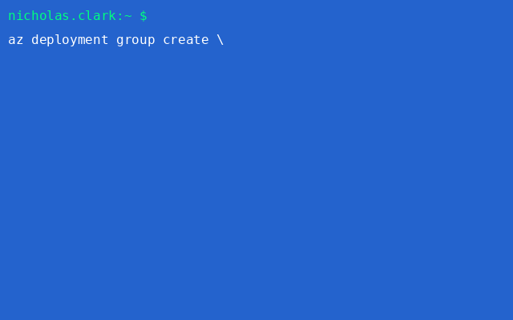

# ☁️ AKS Monitoring IaC Lab

This project provisions a **production-grade Azure Kubernetes Service (AKS)** cluster with **full observability** and **GitOps automation**, powered by **Bicep** and Azure-native tooling.

---

## 🧱 Infrastructure as Code

Everything is modularized using [Bicep](https://learn.microsoft.com/en-us/azure/azure-resource-manager/bicep/overview), located in the `infrastructure/` folder. This is IaC done right.

---

## 📦 Features

- 🚀 Modular AKS deployment with Bicep
- 📈 Azure Monitor and Log Analytics integration
- 📊 Azure Managed Grafana with unique naming
- 🛡️ Defender for Kubernetes (optional module)
- 🧪 Multi-environment support (dev, prod, etc.)
- 🧹 Clean deploy/cleanup scripts (handles orphaned Grafana too)

---

## 📁 Folder Structure (Relevant Parts)

```plaintext
aks-monitoring-iac-lab/
├── assets/
│   └── aks-deploy-preview.gif
├── infrastructure/
│   └── bicep/
│       ├── main.bicep
│       ├── parameters.dev.json
│       ├── parameters.prod.json
│       └── modules/
│           ├── aks.bicep
│           ├── grafana.bicep
│           ├── loganalytics.bicep
│           ├── monitoring.bicep
│           ├── network.bicep
│           └── network-watcher.bicep
├── manifests/
│   ├── dev/
│   │   └── nginx/
│   │       ├── deployment.yaml
│   │       ├── namespace.yaml
│   │       ├── service.yaml
│   │       └── kustomization.yaml
│   └── prod/
│       └── nginx/
│           ├── deployment.yaml
│           ├── namespace.yaml
│           ├── service.yaml
│           └── kustomization.yaml
├── scripts/
│   ├── cleanup.sh
│   └── deploy.sh
```

---

## 🚀 Deploy It

```bash
./scripts/deploy.sh NickClarkRG dev eastus
```

This will:

- 🔧 Create the resource group if it doesn’t exist
- 🧱 Deploy the full infrastructure using Bicep
- 🔍 Provision Azure Monitor, Network Watcher, and AKS
- 🔐 Configure your kubeconfig automatically

## 🆘 Help

```bash
./scripts/deploy.sh -h
```

Displays usage instructions with emoji prompts 💬

---


## 🧹 How to Clean Up
```bash
./scripts/cleanup.sh NickClarkRG
```
What it does:
- ✅ Deletes the specified resource group (if it exists)
- 🔎 Searches your subscription for orphaned Grafana instances and deletes them

---


## 📥 Prerequisites

- Azure CLI >= 2.30
- Logged in with az login
- Active subscription with resource deployment permissions
- kubectl installed

---


## 🧠 Current Features

- 🚀 Deploys AKS cluster with modular Bicep
- 📈 Azure Monitor + Log Analytics integration
- 📊 Azure Managed Grafana (with unique name support)
- 🔁 GitOps via FluxCD (for dev/prod)
- 🛡️ Optional Defender for Containers (can be excluded)
- 🧹 Smart deploy and cleanup scripts (even finds orphaned Grafana)
- 🧪 Environment support for `dev`, `prod`, etc.

---


## 📍 Roadmap
- ✅ Modularize core resources with Bicep
- ✅ Add loganalytics.bicep and grafana.bicep modules
- ✅ Unique Grafana workspace naming using hash
- ✅ Smart cleanup for RG + Grafana anywhere
- 🔁 GitOps auto-bootstrapping with Flux
- 🔜 GitHub Actions pipeline for CI/CD
- 🔜 Alert rules + dashboards via Grafana provisioning

---


## 🧠 Learn More

| 🔍 Topic                        | 📚 Documentation / Resource                                                                 |
|-------------------------------|---------------------------------------------------------------------------------------------|
| Azure Bicep                   | [What is Bicep?](https://learn.microsoft.com/en-us/azure/azure-resource-manager/bicep/overview) |
| Azure Kubernetes Service (AKS)| [AKS Overview](https://learn.microsoft.com/en-us/azure/aks/)                                |
| Azure Monitor                 | [Monitoring AKS with Azure Monitor](https://learn.microsoft.com/en-us/azure/azure-monitor/containers/container-insights-overview) |
| Azure Managed Grafana         | [Managed Grafana Overview](https://learn.microsoft.com/en-us/azure/managed-grafana/overview) |
| FluxCD (GitOps)               | [Flux Documentation](https://fluxcd.io/docs/)                                               |
| GitOps on Azure               | [Use GitOps with AKS](https://learn.microsoft.com/en-us/azure/azure-arc/kubernetes/tutorial-use-gitops-flux2) |
| Defender for Containers       | [Defender for Containers Overview](https://learn.microsoft.com/en-us/azure/defender-for-cloud/defender-for-containers-introduction) |
| Azure Network Watcher         | [Azure Network Watcher Docs](https://learn.microsoft.com/en-us/azure/network-watcher/network-watcher-monitoring-overview) |
| Infrastructure as Code (IaC)  | [IaC with Azure](https://learn.microsoft.com/en-us/azure/devops/learn/devops-at-microsoft/infrastructure-as-code) |

---

## 👑 Part of the NickDoesDevOps Portfolio  
Follow more projects like this at [github.com/NickTheDevOpsGuy](https://github.com/NickTheDevOpsGuy)

> _World Domination, One Pipeline at a Time™_
